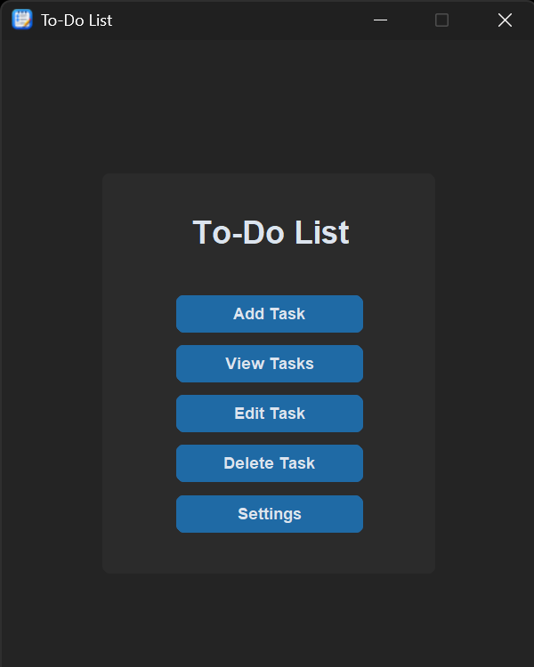
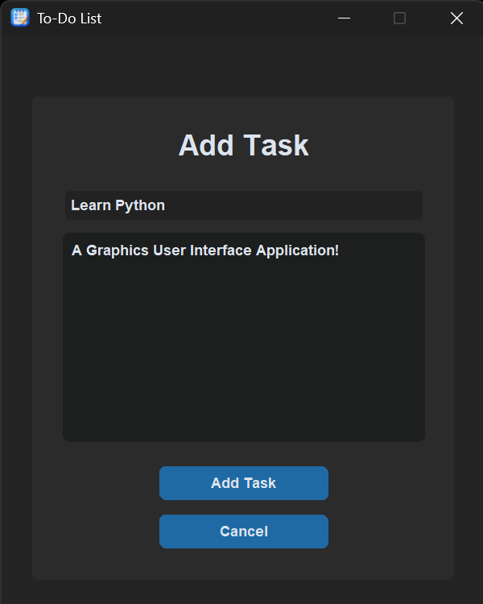
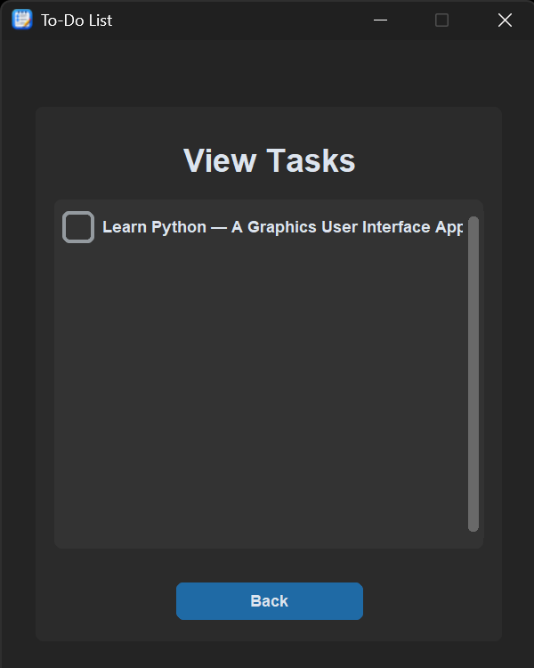
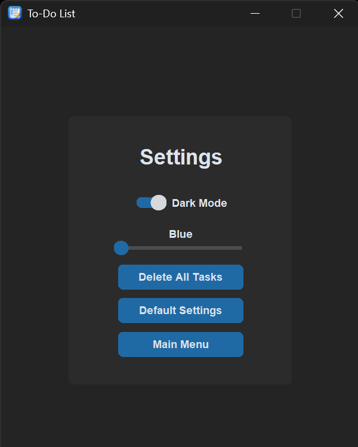

# 📝 To-Do List

A simple **desktop To-Do List application built with Python and CustomTkinter**.

This project was created as a personal programming project to practice **Python, object-oriented programming, GUI development, event handling, JSON file handling, and application state management**.

The application allows users to create tasks, view their tasks, mark tasks as completed, and customize the application's appearance.

---

## ✨ Features

### 📝 Task Management

* Add new tasks
* Add task descriptions
* View saved tasks
* Mark tasks as completed
* Save task completion status
* Delete all tasks

Tasks are stored in a JSON file and can be loaded again when the application is reopened.

### ⚙️ Settings

The application includes a settings menu where users can customize:

* 🌙 Light/Dark mode
* 🎨 Color theme
* 🔄 Reset to default settings
* 🗑️ Delete all tasks

The application currently provides **Blue, Dark Blue, and Green** color themes.

### 💾 Persistent Data

The application uses **JSON files** to store data.

```text
data/
├── settings.json
└── tasks.json
```

Application settings are loaded when the program starts and saved whenever the user changes their settings.

Tasks are also stored in `tasks.json`, allowing task information and completion states to persist between application sessions.

---

# 📸 Screenshots

Here are some screenshots of the To-Do List application in action.

### 🏠 Main Menu



---

### 📝 Add Task



---

### 👀 View Tasks



---

### ⚙️ Settings



---

# 📁 Project Structure

```text
to-do-list/
│
├── asset/
│   └── icon.ico
│
├── data/
│   ├── settings.json
│   └── tasks.json
│
├── screenshots/
│   ├── main-menu.png
│   ├── add-task.png
│   ├── view-tasks.png
│   ├── settings.png
│
├── main.py
├── settings_manager.py
├── tasks_manager.py
│
├── README.md
└── .gitignore
```

---

# 🧩 Source Files

### `main.py`

Contains the main application window and GUI functionality.

The application initializes the settings and task managers, loads saved settings, configures the appearance and color theme, and creates the main menu.

The main menu provides:

```text
[ Add Task ]
[ View Tasks ]
[ Edit Task ]
[ Delete Task ]
[ Settings ]
```

### `settings_manager.py`

Handles loading and saving application settings using JSON.

The default settings include:

* System appearance
* Blue color theme
* Blue theme name
* Theme number

### `tasks_manager.py`

Handles task data stored in `data/tasks.json`.

It provides functions for:

* Saving tasks
* Loading tasks
* Updating tasks

---

# 🛠️ Built With

* **Python** — Programming language
* **CustomTkinter** — GUI framework
* **Tkinter** — Message boxes and GUI functionality
* **JSON** — Persistent data storage

---

# 📋 Task Data

Each task is stored as a JSON object containing:

```json
{
    "id": 1,
    "name": "Example Task",
    "description": "This is an example task.",
    "completed": 0
}
```

The `completed` value is changed when the checkbox is selected or deselected.

---

# 🚀 Getting Started

## Requirements

* **Python 3**
* **CustomTkinter**

Install CustomTkinter with:

```bash
pip install customtkinter
```

## Running the Application

Clone the repository:

```bash
git clone https://github.com/joshwell-glitch/to-do-list
```

Navigate into the project:

```bash
cd to-do-list
```

Run the application:

```bash
python main.py
```

---

# 📌 Current Limitations

This project is still a **work in progress**.

Current limitations include:

* The Edit Task interface is currently a placeholder.
* The Delete Task interface is currently a placeholder.
* No task priority system
* No due dates
* No task categories
* No search or filtering
* No task sorting options
* Task IDs are currently managed within the application session

---

# 🎯 Learning Goals

This project was created to practice:

* Python programming
* Object-oriented programming
* GUI development
* CustomTkinter
* Classes and objects
* Event handling
* JSON file handling
* Reading and writing files
* Persistent application settings
* Managing application state
* Basic CRUD concepts

---

# 👨‍💻 Author

**Joshwell**

Created on **August 12, 2026**.

---

⭐ **Thanks for checking out my To-Do List project!**
